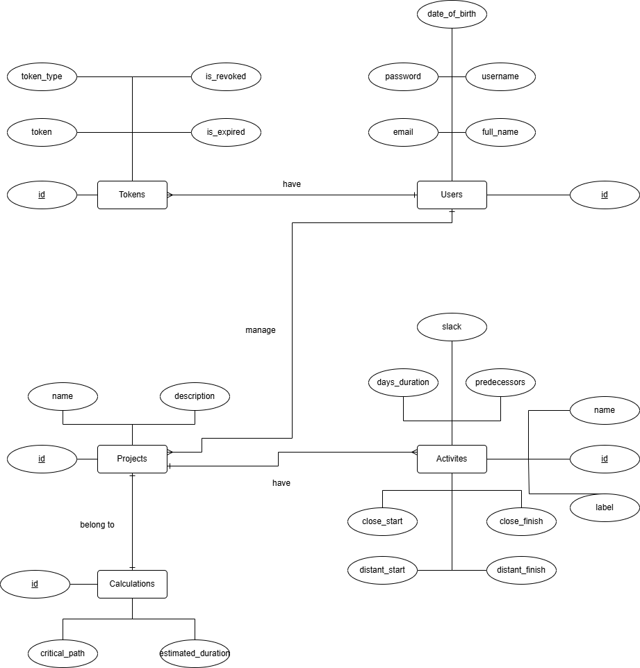

# Entity-Relationship Diagram (ERD)

The Entity-Relationship Diagram (ERD) illustrates the logical structure of the database and highlights the relationships between entities. It is designed to manage users, tokens, projects, activities, and critical path calculations. Below is a detailed description of each entity and their relationships:

---

## Entities and Attributes

### 1. **Users**
This entity represents the users of the system and includes their personal and authentication details.

- **Attributes**:
    - `id`: Unique identifier for each user.
    - `username`: User's displaying name in the app.
    - `password`: User's hashed password for authentication.
    - `email`: Email address of the user (also used for authentication).
    - `full_name`: Full name of the user.
    - `date_of_birth`: The user's date of birth.

### 2. **Tokens**
This entity stores authentication tokens for user sessions.

- **Attributes**:
    - `id`: Unique identifier for the token.
    - `token_type`: Type of the token (e.g., BEARER).
    - `token`: The token string used for authentication.
    - `is_revoked`: Indicates whether the token has been invalidated.
    - `is_expired`: Indicates whether the token has expired.

### 3. **Projects**
This entity represents the projects managed in the system.

- **Attributes**:
    - `id`: Unique identifier for each project.
    - `name`: The name of the project.
    - `description`: A brief description of the project.

### 4. **Activities**
This entity tracks activities related to a project, including their dependencies and timeframes.

- **Attributes**:
    - `id`: Unique identifier for each activity.
    - `label`: A label in A...Z, AA...ZZ, AAA...ZZZ order. Used to indicate the order of the activities in a project.
    - `name`: The name of the activity.
    - `days_duration`: The estimated duration of the activity in days.
    - `predecessors`: The activities that must be completed before this one can start. The format is "A,B,C...Z,AA...ZZ,AAA...ZZZ"
    - `slack`: The amount of time an activity can be delayed without affecting the project's timeline.
    - `close_start`: Earliest start time for the activity.
    - `close_finish`: Earliest finish time for the activity.
    - `distant_start`: Latest start time for the activity.
    - `distant_finish`: Latest finish time for the activity.

### 5. **Calculations**
This entity stores critical path calculations for each project.

- **Attributes**:
    - `id`: Unique identifier for the calculation.
    - `critical_path`: The calculated critical path for the project.
    - `estimated_duration`: Total estimated duration based on the critical path (in days).

---

## Relationships

### 1. **Users and Tokens**
- **Relationship**: One user can have multiple tokens.
- **Description**: This relationship allows users to have multiple sessions.

### 2. **Users and Projects**
- **Relationship**: One user can manage multiple projects.
- **Description**: Each project is associated with a user who manages it.

### 3. **Projects and Activities**
- **Relationship**: A project can have multiple activities.
- **Description**: This relationship defines the tasks that belong to a specific project.

### 4. **Projects and Calculations**
- **Relationship**: Each project is linked to a single critical path calculation.
- **Description**: The critical path calculation provides the must follow path for the project.

---

## Diagram Overview
The ERD visually outlines the connections between users, their authentication tokens, managed projects, associated activities, and critical path calculations.

For more details, refer to the specific [Relational Model Diagram](rm_diagram.md).