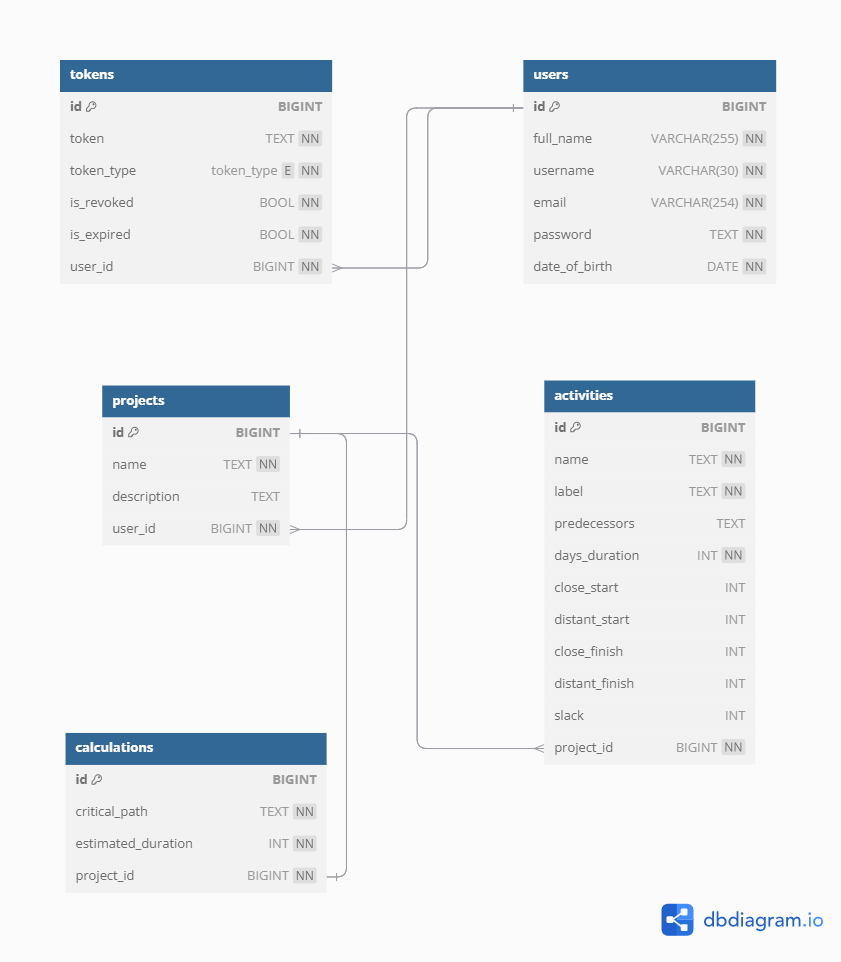

# Relational Model Diagram

The relational model provides a detailed representation of the database schema, illustrating tables, their attributes, and the relationships between them.

---

## Enum Type

---

### `token_type`

- Enum type used in the `tokens` table.
- Allowed values:
    - `BEARER`

---

## Tables and Attributes

---

### `users`

This table stores information about the users of the system.

**Columns:**

- `id` (BIGINT): Unique identifier for the user. Primary key.
- `full_name` (VARCHAR(255)): Full name of the user. Cannot be null.
- `username` (VARCHAR(30)): Username. Cannot be null.
- `email` (VARCHAR(254)): Unique email address. Cannot be null.
- `password` (TEXT): Password for the user account. Cannot be null.
- `date_of_birth` (DATE): User's date of birth. Cannot be null.

---

### `projects`

This table represents projects created and managed by users.

**Columns:**

- `id` (BIGINT): Unique identifier for the project. Primary key.
- `name` (TEXT): Name of the project. Cannot be null.
- `description` (TEXT): Description of the project.
- `user_id` (BIGINT): Identifier for the user who owns the project. Foreign key referencing `users(id)`.

---

### `activities`

Stores information about activities within projects.

**Columns:**

- `id` (BIGINT): Unique identifier for the activity. Primary key.
- `name` (TEXT): Name of the activity. Cannot be null.
- `label` (TEXT): Label for the activity. Cannot be null.
    - The format starts with A...Z, then AA...ZZ, AAA...ZZZ, etc.
- `predecessors` (TEXT): Predecessor activities for this activity.
    - Format is comma-separated, e.g., `A,B,C,D`.
- `days_duration` (INT): Duration of the activity in days. Cannot be null.
- `close_start` (INT): Closest possible start in days.
- `distant_start` (INT): Latest possible start in days.
- `close_finish` (INT): Closest possible finish in days.
- `distant_finish` (INT): Latest possible finish in days.
- `slack` (INT): Slack time in days.
- `project_id` (BIGINT): Identifier for the project to which the activity belongs. Foreign key referencing `projects(id)`.

---

### `calculations`

This table stores critical path calculations for projects.

**Columns:**

- `id` (BIGINT): Unique identifier for the calculation. Primary key.
- `critical_path` (TEXT): Critical path for the project.
    - Format is hyphen-separated, e.g., `L-M-N-O-P`.
- `estimated_duration` (INT): Estimated duration for the project in days.
- `project_id` (BIGINT): Identifier for the project associated with the calculation. Foreign key referencing `projects(id)`.

---

### `tokens`

Stores authentication tokens for users.

**Columns:**

- `id` (BIGINT): Unique identifier for the token. Primary key.
- `token` (TEXT): The token string. Must be unique and cannot be null.
- `token_type` (`token_type` ENUM): The type of token. Cannot be null.
- `is_revoked` (BOOL): Indicates if the token is revoked. Cannot be null.
- `is_expired` (BOOL): Indicates if the token is expired. Cannot be null.
- `user_id` (BIGINT): Identifier for the user associated with the token. Foreign key referencing `users(id)`.

---

## Relationships

- **`projects.user_id` → `users.id`:** Each project is associated with a single user.
- **`activities.project_id` → `projects.id`:** Each activity is associated with a single project.
- **`calculations.project_id` → `projects.id`:** Each calculation is associated with a single project.
- **`tokens.user_id` → `users.id`:** Each token is associated with a single user.

## Diagram Overview

The relational model diagram is a blueprint for how data is stored and accessed in the database. It ensures consistency while supporting key functionalities like user authentication, project management, and activity tracking.
